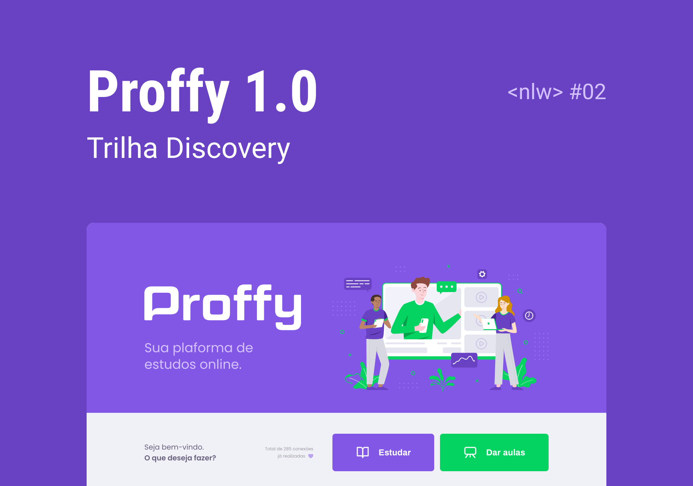

<h1 align="center">
    
</h1>

<h4 align="center">
  🚀 Next Level Week #2
</h4>
<p align="center">
  <a href="https://twitter.com/intent/user?screen_name=LockDzn_">
    
  </a>
</p>

<p align="center">
  <a href="#rocket-tecnologias">Tecnologias</a>&nbsp;&nbsp;&nbsp;|&nbsp;&nbsp;&nbsp;
  <a href="#-projeto">Projeto</a>&nbsp;&nbsp;&nbsp;|&nbsp;&nbsp;&nbsp;
  <a href="#-como-contribuir">Como contribuir</a>&nbsp;&nbsp;&nbsp;|&nbsp;&nbsp;&nbsp;
  <a href="#memo-licença">Licença</a>
</p>

<br>

<p align="center">
  
</p>

<p align="center">
  
  
  
</p>
<br/>

## :rocket: Tecnologias

Esse projeto foi desenvolvido com as seguintes tecnologias:

- [Node.js](https://nodejs.org/en/)
- [TypeScript](https://www.typescriptlang.org/)
- [React](https://reactjs.org)
- [React Native](https://facebook.github.io/react-native/)
- [Expo](https://expo.io/)

## 💻 Projeto

Proffy é um projeto que busca conectar professores e alunos


### Instalar API 

```bash
# Clone this repository
$ git clone https://github.com/LockDzn/proffy

# Go into the repository
$ cd proffy/server

# Install dependencies
$ yarn install

# Run Migrates
$ yarn knex:migrate

# Start server
$ yarn start

# running on port 3333
```

### Instalar Front-end

```bash
# Clone this repository
$ git clone https://github.com/LockDzn/proffy

# Go into the repository
$ cd proffy/web

# Install dependencies
$ yarn install

# Run
$ yarn start

# running on port 3000
```

### Instalar mobile

```bash
# Clone this repository
$ git clone https://github.com/LockDzn/proffy

# Go into the repository
$ cd proffy/mobile

# Install dependencies
$ yarn install

# Run
$ yarn start

# Expo will open, just scan the qrcode on terminal or expo page

# If some problem with fonts, execute:
$ expo install expo-font @expo-google-fonts/archivo @expo-google-fonts/poppins

```

## 🤔 Como contribuir

- Make a fork;
- Create a branck with your feature: `git checkout -b my-feature`;
- Commit changes: `git commit -m 'feat: My new feature'`;
- Make a push to your branch: `git push origin my-feature`.

Depois que o merge da sua pull request for feito, você pode deletar a sua branch.

## :memo: Licença

Esse projeto está sob a licença MIT. Veja o arquivo [LICENSE](LICENSE) para mais detalhes.

---

Feito com ♥ by Ryan Souza (LockDzn) & Rocketseat 👋 [Entre na nossa comunidade!](https://discordapp.com/invite/gCRAFhc)
